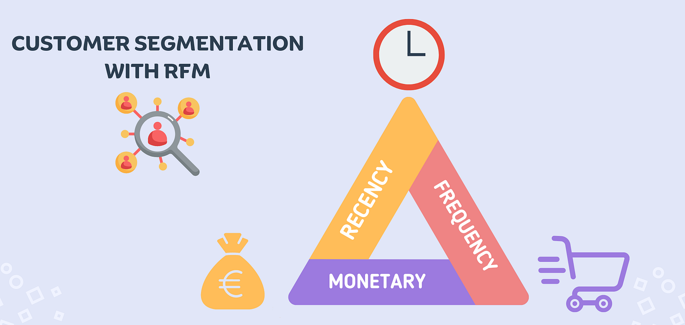

# Customer_Segmentation_and_RFM_Analysis
“An end-to-end customer analytics notebook that cleans retail transaction data and applies EDA, cohort analysis, RFM segmentation, Pareto analysis, K-Means clustering, and market basket analysis to drive retention, segmentation, and product recommendation insights.”

# 📂 Notebook Files

Customer_Segmentation_and_Retention_Analysis.ipynb – Full workflow including EDA, RFM, clustering, and market basket analysis

# ⚡ How to Run

1. Open the notebook in Google Colab
2. Mount Google Drive and upload the dataset
3. Install required packages, especially:
```
!pip install orange3
!pip install Orange3-Associate
```
4. Run each notebook cell sequentially





# 📖 Project Overview

This project provides an end-to-end customer analytics solution using real retail transaction data. It focuses on understanding customer behavior, identifying high-value customers, and generating actionable business insights.

### Key analyses include:

- Data cleaning & preprocessing: Removing duplicates, handling missing values, and filtering inconsistent transactions.
- Exploratory Data Analysis (EDA): Revenue trends, top products, order distribution, and seasonality analysis.
- Cohort & Retention Analysis: Tracking customer retention and repeat purchase behavior over time.
- RFM Analysis & Customer Segmentation: Using Recency, Frequency, and Monetary metrics to classify customers into business-relevant segments.
- Pareto (80-20) Analysis: Identifying top customers contributing most to revenue.
- K-Means Clustering: Discovering hidden patterns in customer behavior for better targeting.
- Market Basket Analysis: Generating product recommendations using association rules (FP-Growth).


### 🛠 Tools & Libraries

The project is implemented in Python (Google Colab) with the following libraries:
- pandas, numpy – Data manipulation
- matplotlib, seaborn – Data visualization
- scipy, sklearn – Statistical analysis and machine learning
- Orange3 & Orange3-Associate – Association rule mining


### 🔍 Dataset

- File: Online Retail Data.xlsx
- Description: Transaction-level data including InvoiceNo, StockCode, Description, Quantity, InvoiceDate, UnitPrice, CustomerID, and Country.
- Note: Ensure the Excel file is uploaded to Google Drive and the path is updated in the notebook.


## 🚀 Steps of Execution

### 1. Data loading & environment setup

In this project, I first mounted Google Drive in Google Colab to access the Excel dataset and imported all required libraries for data manipulation (pandas, numpy), visualization (matplotlib, seaborn), and time handling. Display settings were adjusted to improve readability, and the dataset was loaded into a pandas DataFrame for further analysis.

### 2. Data cleaning & preprocessing

I checked for duplicate rows and removed them to avoid double counting transactions. Missing values were analyzed, especially CustomerID, since anonymous customers cannot be used for customer-level analysis. We also removed inconsistent records such as negative quantities, zero or negative prices, and cancelled invoices (identified by invoice numbers starting with “C”), ensuring the dataset only contains valid, completed purchases.

### 3. Feature creation & transaction validation

After cleaning, I created new features like TotalCost by multiplying quantity and unit price, which allowed me to measure revenue at the transaction level. I also converted date columns into proper datetime formats and restricted the dataset to meaningful time periods for analysis. This prepared a reliable training dataset for customer behavior modeling.

### 4. Exploratory data analysis (EDA)

I explored the dataset to understand business patterns by identifying the transaction time range, country-wise order distribution, yearly and monthly purchase trends, and monthly gross revenue. Visualizations helped reveal seasonality, revenue concentration, product price distributions, and top-selling products, providing business context before applying advanced analytics.

### 5. Cohort & retention analysis

Customers were grouped into monthly cohorts based on their first purchase month. I calculated a cohort index to track customer behavior over time and built retention matrices showing how many customers returned in subsequent months. Heatmaps were used to visualize retention rates, average spending, and average quantities per cohort, giving insight into long-term customer engagement.

### 6. RFM metric construction

I calculated Recency (days since last purchase), Frequency (number of unique invoices), and Monetary (total spending) for each customer. These three metrics summarize customer value and purchasing behavior. Distribution checks and QQ-plots were used to understand skewness and validate transformations before segmentation.

### 7. Pareto principle (80–20 rule) validation

I applied the Pareto principle by ranking customers based on monetary value and calculating how much revenue is generated by the top 20% of customers. The analysis showed that a relatively small group of high-value customers contributes to the majority of revenue, helping identify which customers should be prioritized for retention and marketing strategies.

### 8. RFM scoring & Customer Segmentation

Using quartiles, I assigned scores from 1 to 4 for each RFM metric, where low recency and high frequency/monetary values received higher scores. These scores were combined into a single RFM score (e.g., 444, 244), which allowed us to classify customers into meaningful business segments such as Champions, Loyal Customers, Big Spenders, Almost Lost, and Lost Customers.

- **Q.a: Why is high Recency considered “bad” in RFM scoring?**
- **A:** Higher recency means the customer purchased longer ago, indicating disengagement risk.


- **Q.b: Why are Frequency and Monetary treated opposite to Recency?**
- **A:** Higher frequency and monetary values indicate stronger customer engagement and lifetime value.


- **Q.c: What does an RFM score of 444 represent?**
- **A:** Customers who purchased very recently, purchase frequently, and contribute high revenue is our best customers.


- **Q.d: Why did you convert RFM scores into strings like 434 instead of summing them?**
- **A:** Concatenation preserves individual R, F, and M behavior patterns instead of collapsing them into a single number.


- **Q.e: How did you identify “Champions” in your dataset?**
- **A:** Customers with the highest R, F, and M quartile scores (444).
  

- **Q.f: Why are some high Monetary customers still labeled “Lost”?**
- **A:** They historically spent a lot but have very poor recency, indicating churn risk.
  

- **Q.g: What insight do “Almost Lost” customers provide?**
- **A:** They previously engaged but recently dropped off, making them ideal targets for win-back campaigns.


- **Q.h: How do you validate that your RFM segmentation is meaningful?**
- **A:** By checking revenue distribution, customer counts per segment, and alignment with Pareto analysis.


- **Q.i: What are the limitations of RFM in your notebook?**
- **A:** It is descriptive, not predictive, and does not capture seasonality or product-level preferences.


### 9. Advanced modeling & recommendations

To go beyond rule-based segmentation, I applied K-Means clustering on normalized RFM values to discover hidden customer groups. And validated the optimal number of clusters using silhouette scores and visualized clusters with scatter and snake plots. Finally, I performed market basket analysis using FP-Growth to generate association rules, enabling product recommendations and cross-selling insights.

- **Q.j: How would marketing strategies differ for each segment?**
- A: Champions get rewards and referrals, loyal customers get cross-sell offers, and at-risk customers get re-engagement campaigns.


- **Q.k: How would you measure success after acting on these segments?**
- **A:** By tracking retention rate, repeat purchase frequency, and incremental revenue by segment.


- **Q.l: Why did you suggest K-Means after RFM?**
- **A:** RFM provides rule-based segmentation, while K-Means captures hidden behavioral patterns without predefined thresholds.


- **Q.m: How would combining RFM with clustering improve insights?**
- **A:** It blends business interpretability with data-driven segmentation for more precise targeting.


## 📊 Key Insights

- A small percentage of customers (~20%) contribute to the majority of revenue, confirming the Pareto principle.
- Cohort analysis identifies high-retention segments and declining customer behavior.
- RFM scoring helps target specific segments for marketing campaigns, retention, and rewards.
- K-Means clusters reveal hidden customer behavior patterns not visible in rule-based segmentation.
- Association rules provide cross-selling and recommendation opportunities.


## 💡 Business Applications

- Target high-value customers with loyalty programs.
- Identify at-risk customers and create retention campaigns.
- Drive cross-selling and upselling with product recommendations.
- Prioritize marketing and promotional efforts for segments contributing most to revenue.


